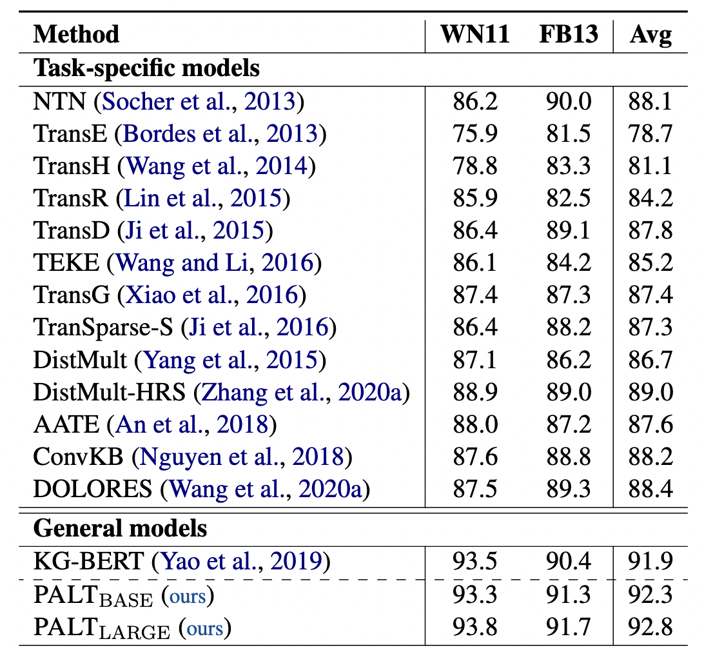
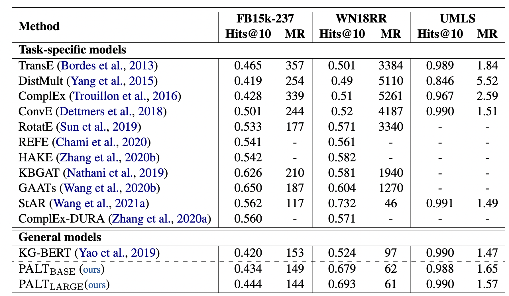

# PALT: Parameter-Lite Transfer of Language Models for Knowledge Graph Completion

## Prepare the data
```bash
cd data
bash prepare_data.sh
cd ..
```

## Prepare the environment
```bash
conda create -n palt python=3.6
conda activate palt
conda install pytorch=1.6.0 cudatoolkit=10.1 -c pytorch
conda install tqdm matplotlib
pip install transformers==3.0.2
```

## Run our model
```bash
bash WN11.sh
bash FB13.sh
bash umls.sh
bash WN18RR.sh
bash FB15k237.sh
```

## Results
### Triplet Classification

### Link Prediction

## Citation
```bibtex
@inproceedings{shen-etal-2022-lass,
    title = "PALT: Parameter-Lite Transfer of Language Models for Knowledge Graph Completion",
    author = "Jianhao Shen and Chenguang Wang and Ye Yuan and Jiawei Han and Heng Ji and Koushik Sen and Ming Zhang and Dawn Song",
    booktitle = "Findings of the Association for Computational Linguistics: EMNLP 2022",
    year = "2022",
    publisher = "Association for Computational Linguistics"
}
```
